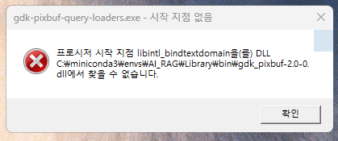

71일차 수업 내용입니다.

# AI_RAG 라이브러리 설치

## Conda 기반 하드웨어/시스템 라이브러리 설치
LangChain을 제외한 데이터 처리, 벡터 DB, 모델 관련 기초 라이브러리를 Conda로 먼저 설치한다.

conda install -c conda-forge numpy=1.26.4 faiss-cpu python-dotenv openpyxl pypdf bs4 tiktoken transformers langdetect gradio  
위와 같이 한번에 설치할 때 아래와 같은 경고창이 화면에 나타나며 롤백되면 라이브러리를 한 개씩 설치한다.  

 
conda install -c conda-forge nbclassic  
conda install -c conda-forge numpy=1.26.4  
conda install -c conda-forge faiss-cpu  
conda install -c conda-forge python-dotenv  
conda install -c conda-forge openpyxl  
conda install -c conda-forge pypdf  
conda install -c conda-forge bs4  
conda install -c conda-forge tiktoken  
conda install -c conda-forge transformers  
conda install -c conda-forge langdetect  
conda install -c conda-forge gradio  

프로그램이 요구하면 아래의 라이브러리도 추가로 설치한다.  
conda install -c conda-forge pandas  
conda install -c conda-forge pytorch  
conda install -c conda-forge ipywidgets  
conda install -c conda-forge tqdm

## Pip 기반 패키지 및 LangChain 생태계 일괄 설치
LangChain 핵심 패키지와 모든 LLM 제공자 패키지를 pip으로 한 번에 설치한다.

pip install "langchain>=0.3.0,<0.4.0" "langchain-core>=0.3.0,<0.4.0" "langchain-community>=0.3.0,<0.4.0" "langchain-text-splitters>=0.3.0,<0.4.0" "langchain-experimental>=0.3.0,<0.4.0" "langchain-openai" "langchain-anthropic" "langchain-chroma" "langchain-huggingface" "langchain-ollama" "langchain-google-genai" "langchain-groq" "pydantic>=2.7.0,<3.0.0" "anthropic>=0.30.0" google-genai groq krag kiwipiepy rank_bm25 jq sentence-transformers  
